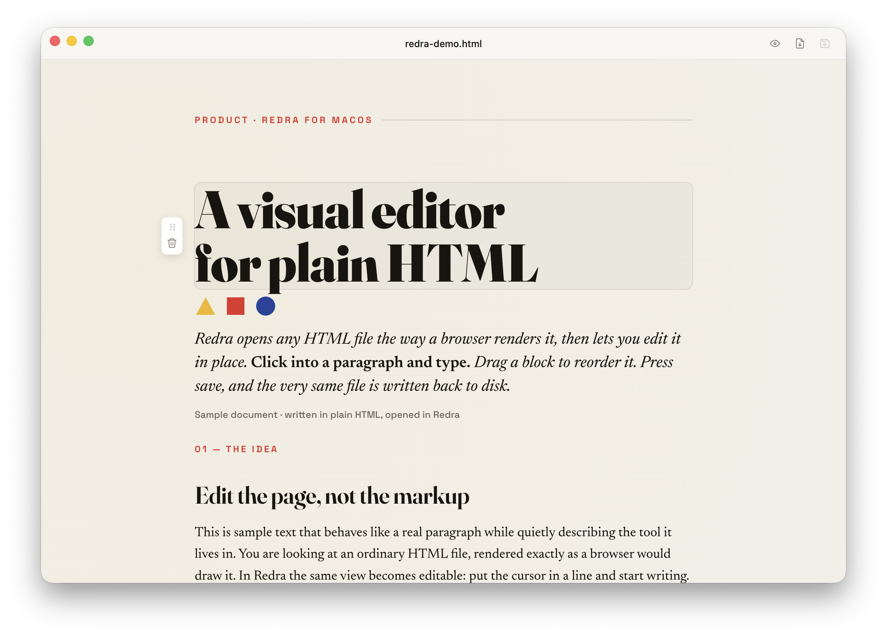
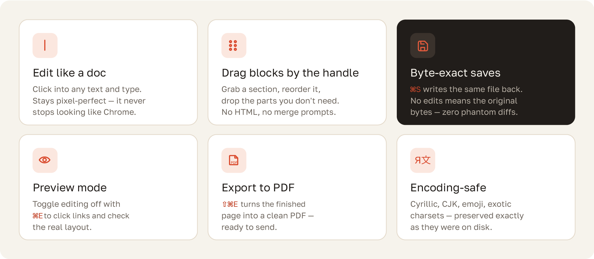
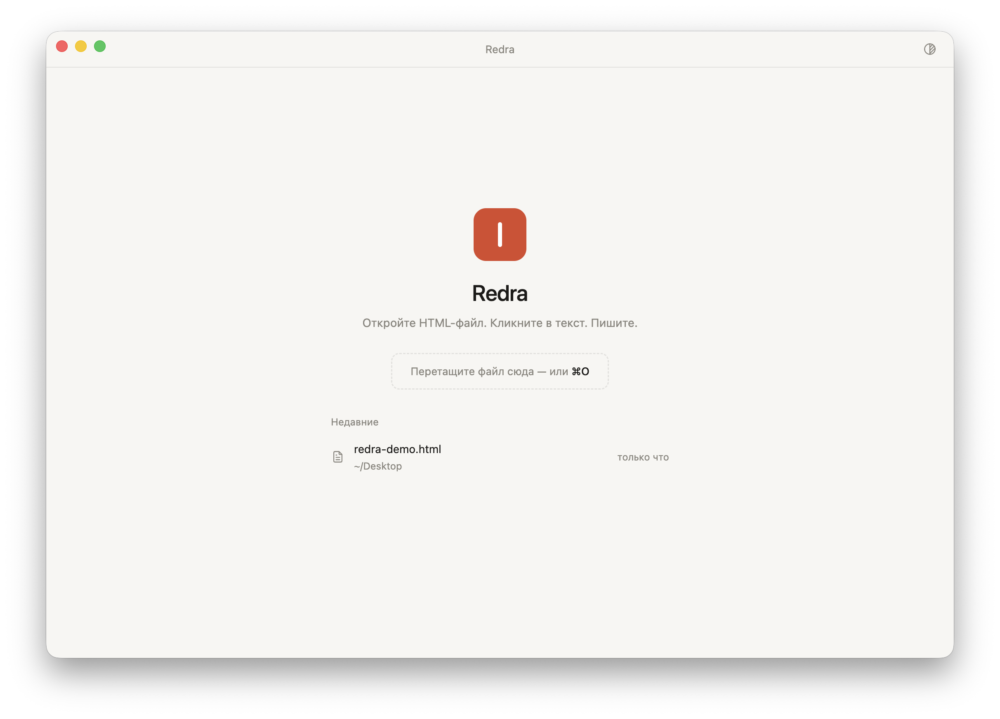

# Redra — a visual editor for HTML files

**Open HTML. Click. Write.**

Redra is a WYSIWYG editor for plain HTML files on macOS. Open any HTML file —
a report, a presentation, an AI-generated page — and it renders exactly like
it does in Chrome. Click into the text and type. Drag blocks by their handle,
delete what you don't need, hit ⌘S — and the **same file** is saved back to
disk. No code, no broken layout. Or export it to PDF.





**New in v0.3.0:**

- **Multiple windows** — every document opens in its own window (or a native
  macOS tab); ⌘N adds another.
- **Block duplication** — a copy button on the block handle clones the block
  right below the original, styles intact; rewrite the text and done.
- **Find in document** — ⌘F opens a quiet find bar in the titlebar with
  native match highlighting and a match counter.

**New in v0.2.0:**

- **Image replacement** — click an image (or drop a file onto it) to swap it;
  the picture is embedded into the document, which stays a single
  self-contained file.
- **Version history** — every session's first save keeps a timestamped copy;
  File → Version History restores any of them (the current state is backed up
  first, so a restore is always undoable).
- **Inline formatting** — select text while editing and a small toolbar
  appears: bold, italic, code, link.

## Why your file is safe

Redra never rewrites your file — it edits it.

Most tools that "open" HTML save their **own version** of it: styles mangled,
scripts reformatted, layout subtly broken (try editing an HTML file in Word).
Redra keeps the original untouched and records your edits as a short list of
operations. On save, exactly those operations are applied to the original —
and nothing else. Change one word, and one word is all that changes in the
file. Change nothing, and the saved file is byte-for-byte identical to what
you opened.

That's the whole trick — and it means your embedded styles, scripts, charts
and fonts survive every edit.

<details>
<summary>For the technically curious</summary>

On open, the file is parsed (parse5) into a pristine reference tree; the
window shows a stamped copy where every source element carries a stable id.
User actions become journal operations (<code>editText</code>,
<code>deleteBlock</code>, <code>moveBlock</code>, <code>setAttr</code>)
referencing those ids. The
live DOM is never serialized — page scripts can mutate it freely without
polluting saves. On ⌘S the journal is replayed onto a clone of the pristine
tree; element attributes are restored from the source (provenance check), so
even runtime DOM state can't leak into the file. An empty journal short-cuts
to writing the original bytes.

</details>



## Install

1. Download `Redra-<version>-arm64.dmg` from the
   [Releases](https://github.com/redraaya/Redra/releases) page (Apple Silicon
   only).
2. Open the DMG and drag **Redra** into **Applications**.
3. **First launch**: the app is not signed with an Apple certificate, so
   Gatekeeper blocks it with a message that it could not be opened. This is
   expected — do the following:
   1. Try to open Redra (double-click). A warning appears — click
      **Done**/**OK**.
   2. Open **System Settings → Privacy & Security** and scroll down: an
      **"Open Anyway"** button appears next to the message about Redra (the
      button only shows up after the first launch attempt).
   3. Click it and confirm (you'll need your password or Touch ID).

   You only do this once — afterwards Redra opens normally.
   Terminal alternative:

   ```sh
   xattr -cr /Applications/Redra.app
   ```

Once installed, Redra shows up in Finder's "Open With…" menu for `.html` and
`.htm` files.

## Hotkeys

| Shortcut | Action |
| --- | --- |
| ⌘O | Open a file |
| ⌘N | New window |
| ⌘F | Find in the document |
| ⌘S | Save |
| ⇧⌘S | Save As… |
| ⌘E | Preview mode (toggles editing on/off) |
| ⇧⌘E | Export to PDF… |
| ⌘Z | Undo |
| ⇧⌘Z | Redo |
| Esc | Revert the element being edited (back to how it was) or cancel a drag |
| ⌘-click a link | Open the link in your browser |

## Known v1 limitations

- **iframes**: the editing layer does not reach into iframe content — a page
  inside an iframe lives its own life and cannot be edited.
- **`transform`/`filter` on `<html>`**: these styles on the root element
  create a new containing block for `position: fixed`, so the block handle
  pill may be positioned with an offset on such pages.
- One window — one document (open as many windows as you like); relative
  links to sibling `.html` files are deliberately dead inside the document
  view.

## Build from source

```sh
npm install
npm run dev        # run in development mode
npm test           # engine and shell tests
npm run smoke      # build + smoke run of a real window
npm run dist       # DMG for Apple Silicon in dist/
```

## Updates

Redra quietly checks GitHub releases once per launch. When a newer version is
out, a small pill appears in the titlebar — click it to open the download
page, or dismiss it and it won't come back for that version.

## License

[MIT](LICENSE)
